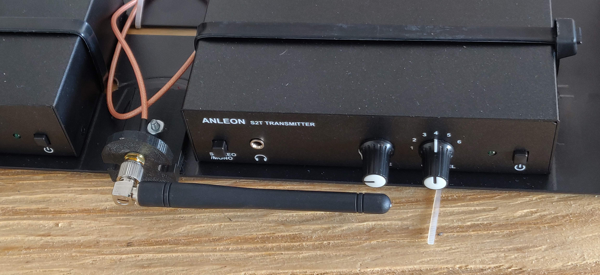
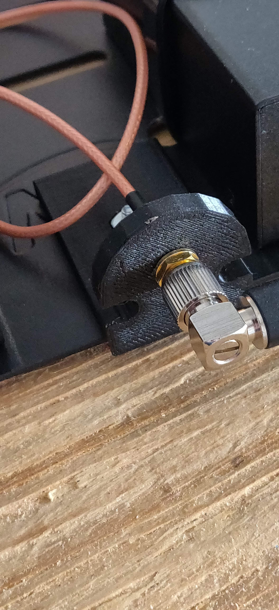
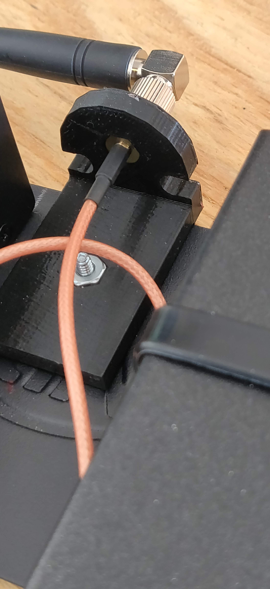
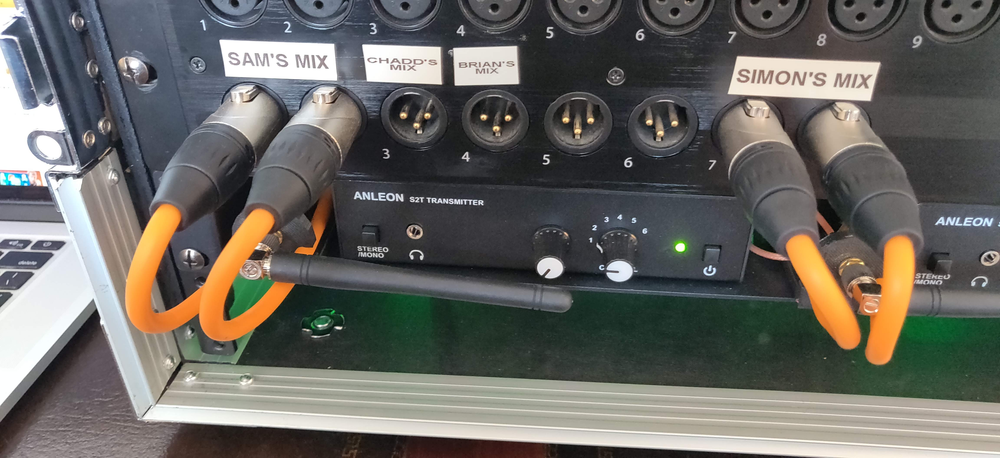

# antenna-relocation-bracket

I've got an in-ear-monitor transmitter with the antenna located in the back.  
I'd like to mount the transmitter on a rack-mount shelf and mount _that_ in a rack along with my [Presonus RM16AI](https://www.presonus.com/products/StudioLive-RM16AI) mixer.  
This bracket - along with an antenna extension cable, will allow me to relocate the antenna to the front of the rack where it'll presumably get better reception.

Take a look at the **.stl** file to see the rendered part.  Here's some pictures of the finished product in action:

